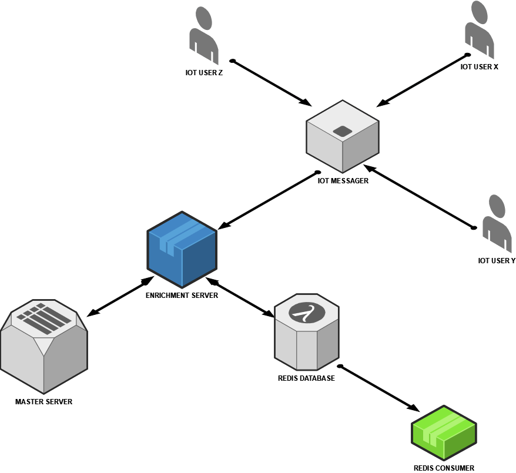

# iot-redis-simulator

## This project simulates a iot integration between a enrichment server and RedisDB

#### Data Enricher.
- Data is generated from an IOT and saved on a messaging server.
- This data is consumed by the enrichment server
- Searches the data in redis, if it does not find a search in another WS, it saves the WS return in redis to facilitate the next search
- Merge the master data with the iot data and save the result in the redis

#### Project implemented using [randomuser.me](https://randomuser.me/)

#### Execute this project.
- Have a Redis instance, (if not in localhost:6379, change it in the project settings)
- Run this project, main in "src/main/java/br/com/ren/server/Application.java"
  - Need to install dependencies with maven
- Run the script in "iot-messager-simulator/index.js" to simulate sending data from IOT